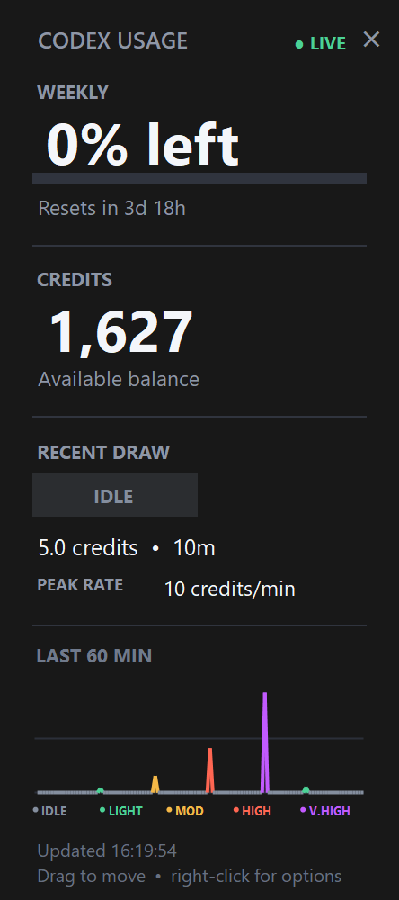

# Codex Usage Widget



A compact, always-on-top Windows widget for monitoring Codex allowance, credit balance, recent draw, peak usage rate, and the last 60 minutes of activity.

> **Unofficial community utility.** This project is not affiliated with or endorsed by OpenAI.

## Download

Download the ZIP from the repository's **Releases** page. Extract the entire archive into a permanent folder before starting the widget.

The application is portable: it has no installer and does not require administrator access.

## Requirements

- Windows
- Codex Desktop installed
- An active Codex sign-in

## Getting started

1. Extract `CodexUsageWidget-v1.0.0-windows.zip` into a permanent folder.
2. Open Codex Desktop and confirm that you are signed in.
3. Double-click `CodexUsageWidget.exe`.
4. Right-click the widget and enable **Launch with Windows** if wanted.

Enable Windows startup only after moving the executable to its permanent location. Moving it afterward will leave the startup entry pointing at the old path; disable and re-enable the option if that happens.

The executable is not digitally code-signed, so Windows may identify it as coming from an unknown publisher. Download releases only from this repository's official Releases page. The complete source and build script are available here for inspection.

## What it shows

- Weekly allowance remaining and reset countdown.
- Current credit balance, using the same upward rounding as Codex Desktop.
- Latest draw total and how long ago it ended.
- Peak credits-per-minute rate within the latest draw.
- A 60-minute activity graph with separate Idle, Light, Moderate, Heavy, and Very High colours.
- Faster three-second refreshes during activity, returning to a 15-second idle interval afterward.

The status checks read account information through the locally installed Codex app server. They do not invoke a model or consume usage credits.

## Controls

- Drag anywhere on the widget to move it.
- Click **×** to hide it to the system tray.
- Double-click the tray icon to restore it.
- Right-click the widget or tray icon for refresh, always-on-top, launch-at-sign-in, reset-position, and exit controls.

## Recent-draw calculation

Meaningful account-balance changes less than 90 seconds apart are grouped into one draw. The widget shows the accumulated credits and the highest comparable interval rate within that draw. After 90 seconds without another meaningful change, the badge returns to **Idle**, while the completed draw's cost, age, and peak rate remain visible.

Fractional changes below half a credit are treated as account-settlement noise. Gaps longer than 45 seconds are not assigned an invented interval rate because the exact timing during the gap is unknown.

| Level | Draw or interval value |
| --- | ---: |
| Idle | no meaningful balance change |
| Light | under 15 credits |
| Moderate | 15 to under 60 credits |
| Heavy | 60 to under 150 credits |
| Very High | 150 credits or more |

Before credits are in use, the widget falls back to changes in the weekly allowance percentage.

## CSV usage log

While running, the widget appends observations to `usage-log.csv` beside the executable. Excel does not need to be open. The file includes local and UTC timestamps, raw credit balance, interval changes, credits per minute, and weekly allowance figures.

Keep the CSV closed while collecting data so another application cannot lock it against writes.

## Privacy and local data

The widget does not copy or store authentication credentials and does not include analytics or telemetry of its own.

Local files are stored in two places:

- `usage-log.csv` beside the executable.
- Seven days of display history, window position, and local settings in `%LOCALAPPDATA%\CodexUsageWidget`.

These files remain on the user's computer unless the user chooses to share them.

## Uninstall

1. Right-click the widget and turn off **Launch with Windows**.
2. Exit the widget.
3. Delete its extracted application folder.
4. Optionally delete `%LOCALAPPDATA%\CodexUsageWidget` to remove local history and settings.

## Build from source

Run:

```powershell
powershell -ExecutionPolicy Bypass -File .\build.ps1
```

The build uses the C# compiler included with Windows. No package download is required.

To build, self-test, and create the distributable ZIP plus SHA-256 checksum:

```powershell
powershell -ExecutionPolicy Bypass -File .\package-release.ps1
```

Release output is written to `release\` and is excluded from Git.

## Troubleshooting

If the widget reports that Codex is unavailable or asks you to sign in:

1. Open Codex Desktop normally.
2. Confirm that the intended account is signed in.
3. Right-click the widget and choose **Refresh now**.

The widget searches the standard Codex Desktop installation location and then the system `PATH`. Advanced users can set `CODEX_WIDGET_CODEX_PATH` to an explicit `codex.exe` path.

## Licence

Released under the [MIT License](LICENSE). See [CHANGELOG.md](CHANGELOG.md) for version history.
